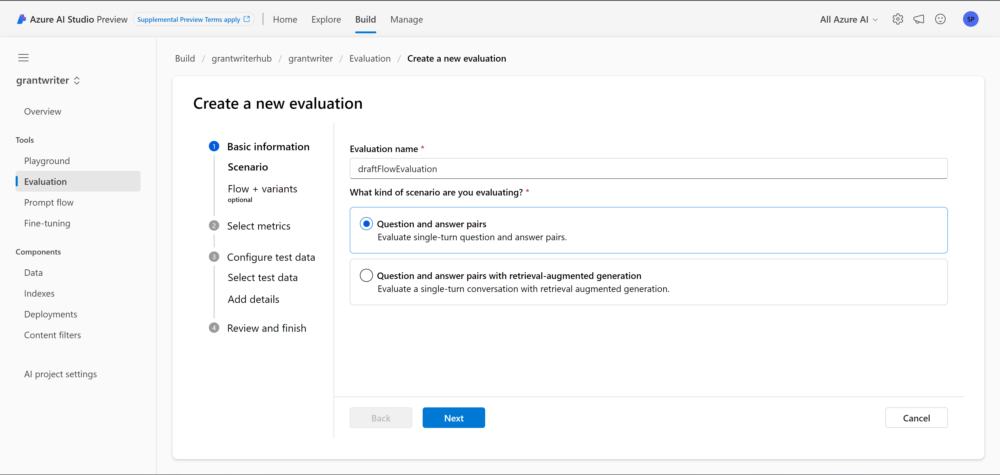
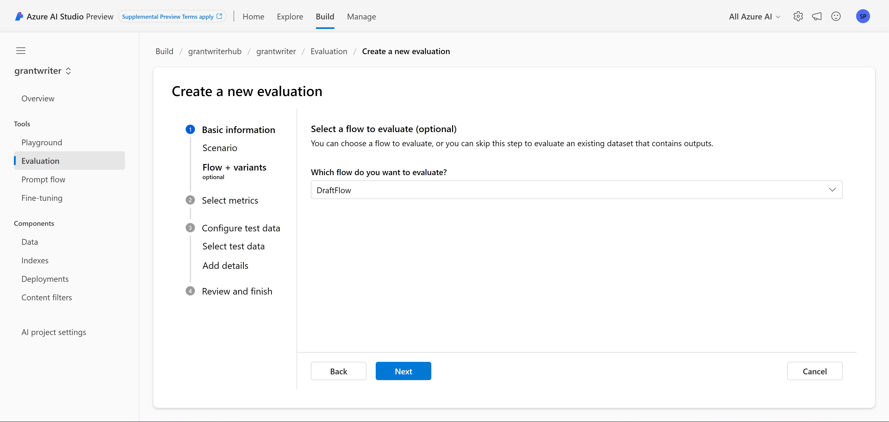
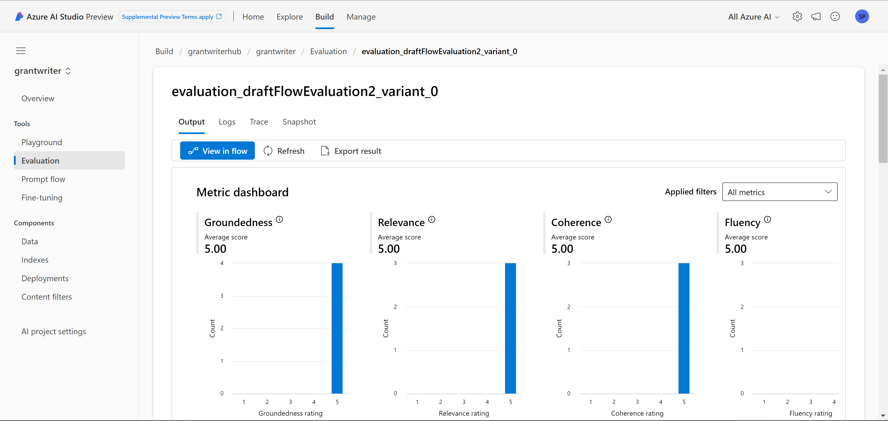

# Setting up an Evaluation Flow in Prompt Flow
<h2>
Evaluation Flow
</h2>

**Evaluation Flow overview**

Evaluation flows are special types of flows that assess how well the outputs of a run align with specific criteria and goals by calculating metrics.

In prompt flow, you can customize or create your own evaluation flow and metrics tailored to your tasks and objectives, and then use it to evaluate other flows

### **How to run Evaluation Flow**

1. Go to https://ai.azure.com/

   
2.  Locate your AI project under recent projects.
 

        
3.  Once inside your project select Evaluation from the left dropdown menu 
 

4. From your Evaluation view, select New evaluation in the middle of the page 
 

5.  From here you can create and name a new evaluation, select your scenario, 
 

6. Select the flow you want to evaluate. (To evaluate the DraftFlow select DraftFlow here)
 

7. Select metrics you would like to use Also be sure to select an active Connection and active Deployment name/Model
 

8. Use an existing dataset or upload a dataset to use in evaluation. 
 

9. Lastly map the inputs from your dataset and click submit
 

### Results

Once the flow has been ran successfully the metrics will be displayed showing a 1-5 score of each respective metric. From here you can click into the evaluation flow to get a better understanding of the scores.
 
 

